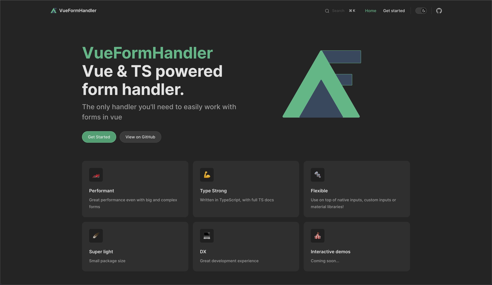

 

<h1 align="center">
  
</h1>
   
### About Me:

  Hi, I'm Dennis R. Bosmans, Front-End software developer based in spain
   
   
  🚀 Creator and maintainer of <a href="https://vue-form-handler.com" target="_blank">vue-form-handler</a>
   
   
  </img>
   
   
  💻 I love Writing code, Hardware and learning every day 😊
   
  📚 I’m currently focusing on Vue.js
   
  📫 How to reach me 👇

 
     
     
    

<h2 align="center">🔥 Languages & Frameworks & Tools & Abilities 🔥</h2> 

  <code></code>
  <code></code>
  <code></code>
  <code></code>
  <code></code>
  <code></code>
  <code></code>
  <code></code>
  <code></code>
  <code></code>
  <code></code>
  <code></code>
  <code></code>
  <code></code>
  <code></code>
  <code></code>
  <code></code>

<h2 align="center">⚡ Stats ⚡</h2>
 

<h2 align="center">💹 Most Popular Repos 💹</h2>
 

   

  

       

<!---
dbssman/dbssman is a ✨ special ✨ repository because its `README.md` (this file) appears on your GitHub profile.
You can click the Preview link to take a look at your changes.
--->
